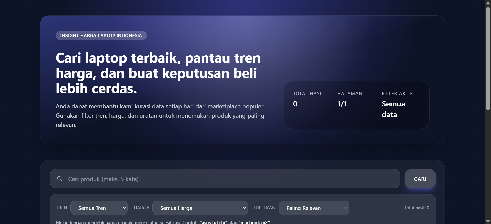
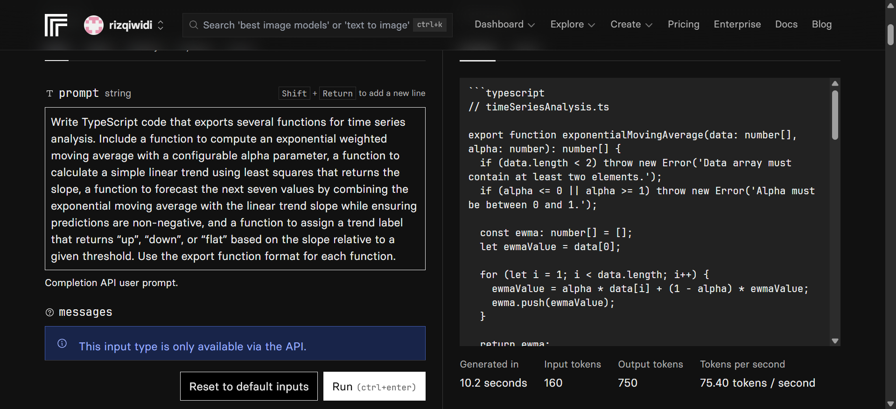

# Mini E-com Laptop Indonesia

> Mini E-com Laptop Indonesia is a curated pricing intelligence project that aggregates historical laptop listings from Indonesia's major marketplaces, normalizes the data through an ETL pipeline, and serves an interactive search experience complete with trend tracking, 7-day forecasts, and community-driven price updates for smarter purchasing decisions.



Live demo: https://mini-ecom-blush.vercel.app/

Dataset: https://www.kaggle.com/datasets/artakusuma/laptopecomerce/

## Highlights
- Smart search with token heuristics so SKU, product name, and brand remain easy to discover.
- Trend and prediction visuals: up/down/stable badges plus latest price change percentage and 7-day forecast.
- Manual submission and feedback: extend the dataset or update prices directly from the UI.
- Integrated ETL pipeline: CSV -> normalized JSON -> automatic upload to Vercel Blob Storage.

## Tech Stack
| Layer | Tools |
|-------|-------|
| Frontend UI | Next.js (App Router), React 18, Tailwind CSS |
| API / Serverless | Next.js API Route (Node.js) |
| Data Processing | TypeScript + `csv-parse/sync`, custom ETL helpers |
| Storage | Vercel Blob (raw CSV + processed JSON) |
| Styling | Tailwind CSS, custom design system |

## Features
- Search and filter: multi-token keyword search, trend filter, price range, and sorting.
- Forecast and trend: direction badge (up/down/stable), latest price change, 7-day forecast values.
- Manual dataset: form-driven submission to extend the dataset without waiting for new ETL runs.
- ETL endpoint (`POST /api/etl`): regenerates `processed/products.json` from CSV stored in Vercel Blob.

## Setup Instructions

### Prerequisites
- Node.js (Project tested with v22.20.0)
- npm 9+ (bundled with recent Node releases)
- Vercel account with Blob Storage enabled (to generate `BLOB_READ_WRITE_TOKEN`)
- Optional: Kaggle account to download the source dataset

### 1. Clone and install
```bash
git clone https://github.com/<your-username>/mini-ecom.git
cd mini-ecom
npm install
```

### 2. Create `.env`
```bash
BLOB_READ_WRITE_TOKEN=your-vercel-blob-token
BLOB_PREFIX=mini-ecom
NEXT_PUBLIC_BASE_URL=http://localhost:3000 # optional, autodetect when omitted
```
- `BLOB_READ_WRITE_TOKEN` -> create from Vercel dashboard (Storage -> Tokens).
- `BLOB_PREFIX` -> namespace for all blob objects. Default is `mini-ecom`; use a unique value to avoid collision when sharing storage.
- `NEXT_PUBLIC_BASE_URL` -> required only when running API calls from other hosts.
- `ETL_BASE_URL` (optional) -> define when the sync script should trigger ETL on a remote deployment instead of localhost.

### 3. Prepare data (recommended)
1. Download the Kaggle dataset and unpack it under `data/` following the existing structure, for example:
   ```
   data/
     laptop/
       January 2021/
         Shopee/
           Acer/
             aspire_shopee_14_01_2021.csv
           ...
   ```
2. Run the sync script below to push CSV files into Vercel Blob. The ETL endpoint reads either from Blob (`mini-ecom/raw/...`) or from the local `data/` tree when Blob is empty.

### 4. Sync CSV into Vercel Blob
```bash
node scripts/sync-blob.mjs
```
- Scans the local `data/` directory and uploads missing CSV files to `mini-ecom/raw/...`.
- Add `--overwrite` to force re-upload and `--trigger-etl` to call `/api/etl` after upload.
- Configure `ETL_BASE_URL` if the ETL should run on a deployed environment (for example Vercel) rather than `http://localhost:3000`.

Example (local dev server running):
```bash
node scripts/sync-blob.mjs --trigger-etl
```

### 5. Run locally
```bash
npm run dev
# visit http://localhost:3000
```

### 6. Regenerate products manually
If you only need to rebuild products from existing blob data:
```bash
curl -X POST http://localhost:3000/api/etl \
  -H "x-cron-token: $BLOB_READ_WRITE_TOKEN"
```
For remote deployments, replace the base URL and ensure `BLOB_READ_WRITE_TOKEN` matches the remote environment.

### 7. Production build and preview
```bash
npm run build
npm run start
```

### 8. Deploy (Vercel + GitHub Actions)
1. Set repository secrets (GitHub -> Settings -> Secrets -> Actions):
   | Key | Description |
   |-----|-------------|
   | `VERCEL_TOKEN` | Personal access token from Vercel (Account Settings -> Tokens). |
   | `VERCEL_ORG_ID` / `VERCEL_PROJECT_ID` | Found in Vercel project dashboard. |
   | `BLOB_READ_WRITE_TOKEN`, `BLOB_PREFIX` | Same values as `.env`, for deployment ETL tasks. |

2. Mirror the same environment variables in Vercel Project Settings (Production and Preview).
3. Push to `main` (or trigger the workflow) to build and deploy automatically.

### 9. Optional automation and testing
- Schedule recurrent ETL via Vercel Cron or GitHub Actions by sending `POST /api/etl` with header `x-cron-token: <BLOB_READ_WRITE_TOKEN>`.
- Validate builds locally with `npm run build`; linting uses Next.js defaults and runs automatically during the build step.

## Data and Manual Submissions
- Processed products live at `processed/products.json` under the configured blob prefix (for example `mini-ecom/processed/products.json`).
- Manual dataset entries are stored at `manual/manual-dataset.json` in blob storage. New submissions through the UI append to this file; you can seed it manually by uploading a JSON array with the same structure (`type: "submission"`, `name`, `brand`, `price`, etc.).

## Key Structure
```
app/
  page.tsx           # Landing page + hero + search section
  api/
    search/route.ts  # Search endpoint (combines ETL + manual submissions)
    etl/route.ts     # ETL trigger (CSV -> aggregated JSON -> Blob)
lib/
  etl.ts             # CSV normalization helpers
  forecast.ts        # EWMA + linear trend utilities
  manual-dataset.ts  # Read/write helpers for manual dataset entries
scripts/
  sync-blob.mjs      # Upload CSV from data/ to Vercel Blob and optional ETL trigger
public/processed/
  products.json      # Ready-to-serve aggregated products
```
## AI Support Explanation



This documentation leverages AI-assisted coding via the Replicate web interface—using the attached prompt—to generate TypeScript reference code as scaffolding for the project’s forecasting module; the AI output was reviewed, adapted, and integrated into lib/forecast.ts (EWMA with configurable alpha, least-squares linear trend returning slope, 7-day forecast combining EWMA+slope with non-negative constraints, and “up”/“down”/“flat” trend labeling powering UI badges and price-change displays), and is provided strictly as reference scaffolding that must undergo code review, customization, and testing before production use.

## Warning
Price information derives from laptop listings scraped in 2020-2021. Marketplace links may have expired, and real-world prices can deviate from the historical data.

---
Keep exploring and build smarter laptop price insights.
